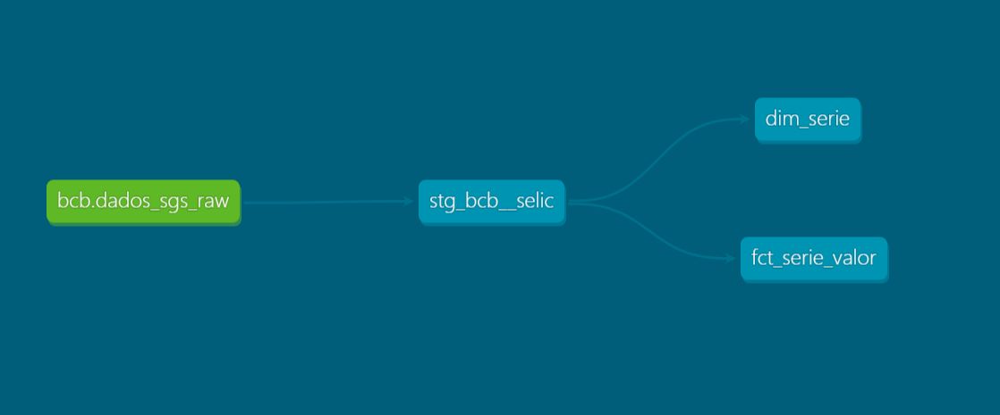

# Pipeline ELT da API do Banco Central com dbt

## Resumo

Pipeline que extrai séries temporais de indicadores econômicos da API do Banco Central, carrega os dados em um banco PostgreSQL com Python e transforma os dados com dbt.

## Stack

Python, PostgreSQL, dbt

## Arquitetura



O dado é extraído da API do Banco Central com Python, em formato de DataFrame do Pandas. Depois é carregado no formato bruto no PostgreSQL, em uma tabela no schema `raw`. O dbt transforma esse dado em uma view de staging no schema `analytics`, com os tipos já convertidos, e a partir dela forma duas tabelas, uma dimensão e uma fato, seguindo um star schema.

## Camadas

**RAW:** onde ficam os dados brutos, que o dbt usa para fazer a staging e, em seguida, os marts.

**STAGING:** uma view que pega os dados brutos da tabela raw e converte os tipos de cada coluna. Ela é um meio-termo entre a raw e os marts: caso dê algum problema ou mudança nos dados da API, os marts continuam lendo da staging, e só ela precisa ser corrigida, em vez de trocar todos os marts.

**MARTS:** as tabelas `dim_serie` e `fct_serie_valor`, um star schema com uma dimensão e uma fato. A dimensão tem o código da série usado na API e o nome da série. A fato tem o valor daquela série em uma data específica.

## Decisões

### Por que ELT e não tratar no pandas?
- Porque os dados ficam salvos no banco antes da transformação, e dá para transformar de novo sem chamar a API toda vez.

### Por que staging é view e marts são table?
- A staging é view porque é leve, intermediária, sempre atualizada e não ocupa espaço.
- Os marts são table porque são consultados com frequência e precisam de consultas rápidas.

### Por que a fato é incremental, e qual filtro escolhi?
- A fato é incremental para não refazer a tabela inteira a cada execução do pipeline. Ela só adiciona os dados que atendem ao filtro.
- Escolhi o filtro que só pega os dados da staging mais novos que a última data que está na fato.

## Testes

**Na `dim_serie`:** na coluna `codigo_serie`, usei `unique` e `not_null`, que garantem que cada série apareça uma vez só e não tenha valor nulo. E o `accepted_values`, que aceita somente a série 11.

**Na `fct_serie_valor`:** na coluna `valor`, usei `not_null`, para não ter nenhum dado nulo. Na coluna `codigo_serie`, usei o `relationships` com a tabela dimensão, que verifica se todo `codigo_serie` da fato existe na dimensão.

## Limitações

### Grão sem teste de combinação
- O que identifica uma linha da fato é o par série + data, e nenhum teste atualmente olha o par. Os testes olham uma coluna por vez.

### Nome da série fixo no CASE
- O nome da série está fixo no SQL da tabela dimensão. Se entrar outra série, ela aparece como "Desconhecida".

### Incremental
- O pipeline só carrega na fato os dados com data maior que a última já gravada. Para carregar dados antigos, é preciso recriar a tabela inteira com `dbt run --full-refresh`.

## Como rodar

**1. Clonar o repositório e entrar na pasta**

```
git clone <url-do-repositorio>
cd <pasta-do-repositorio>
```

**2. Criar e ativar o ambiente virtual**

```
python -m venv venv
.\venv\Scripts\Activate.ps1
```

No Linux ou macOS, a ativação é `source venv/bin/activate`.

**3. Instalar as dependências**

```
pip install -r requirements.txt
```

**4. Criar o `.env` na raiz do projeto, com os dados do seu banco**

```
DB_HOST=
DB_PORT=
DB_NAME=
DB_USER=
DB_PASSWORD=
```

**5. Carregar os dados brutos (a partir da raiz do projeto)**

```
python main.py
```

**6. Configurar a conexão do dbt**

```
cd dbt_sgs_postgres
dbt init
```

Dentro de um projeto que já existe, o `dbt init` só pergunta os dados de conexão e cria o `profiles.yml`. O schema de destino fica à sua escolha (eu usei `analytics`). O arquivo fica em `C:\Users\<seu_usuario>\.dbt\profiles.yml` (no Linux ou macOS, em `~/.dbt/profiles.yml`).

Para confirmar que a conexão funciona:

```
dbt debug
```

**7. Rodar as transformações e os testes**

```
dbt run
dbt test
```

**8. (Opcional) Ver a documentação e o lineage**

```
dbt docs generate
dbt docs serve
```